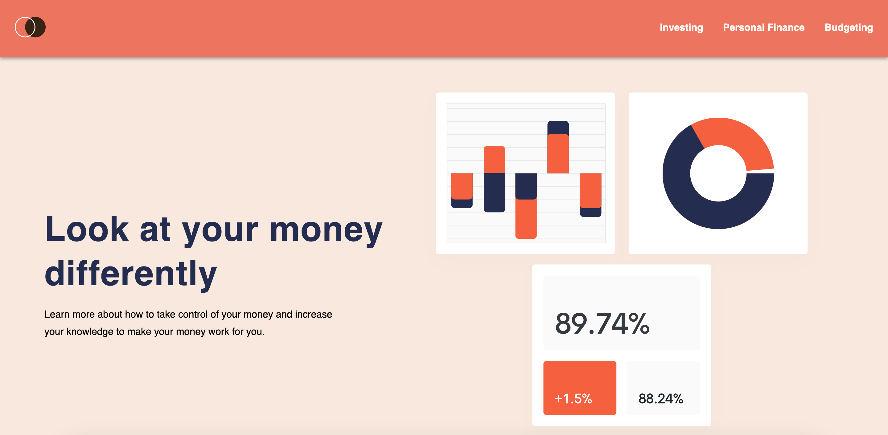

## Welcome!

This project was created using NextJS[https://nextjs.org/], TypeScript[https://www.typescriptlang.org/], Redux[https://redux.js.org/] for state management, SCSS[https://sass-lang.com/] for styling. 

# Overview
I created this project to increase and better my understanding of Frontend frameworks and technologies. I've asked chatGPT to create a list of React challenges that I can take on to increase my understanding of various front-end concepts and problems. Below is the complete list of challenges I was given: 

React Component Challenge: Create a React component that takes a list of items as props and renders them as a grid of cards. Each card should display the item's name, image, and a button to view more information about the item. When the button is clicked, the component should expand to show more information about the item.

Sorting Algorithm Challenge: Implement the quicksort algorithm in JavaScript. The quicksort algorithm is a sorting algorithm that uses the divide-and-conquer approach to sort an array. It works by selecting a "pivot" element from the array and partitioning the other elements into two sub-arrays, according to whether they are less than or greater than the pivot. The sub-arrays are then sorted recursively.

React Redux Challenge: Build a React application that uses Redux to manage state. The application should display a list of items, and each item should have a checkbox next to it. When an item is checked, it should be removed from the list and added to a "completed items" list. The completed items list should be displayed below the main list.

Data Structures Challenge: Implement a stack data structure in JavaScript. A stack is a last-in, first-out (LIFO) data structure that stores a collection of elements. The stack should have the following methods: push, pop, peek, and isEmpty.

React Router Challenge: Create a React application that uses React Router to handle routing. The application should have three pages: a home page, a contact page, and a about page. Each page should have its own URL and should display some content related to the page.

API Integration Challenge: Build a React application that integrates with a third-party API. The application should allow users to search for books by title or author and display the results on the page. When a user clicks on a book, the application should display more information about the book, such as the author, publisher, and ISBN.

# Progress

So far I've just completed the first challenge. As context, I decided to structure my challenges around creating a multi-page website that includes information on increasing one's financial literacy. This page will serve, merely as a point of referece, not official financial advice. 

# Why I chose a financial resource page

As an aspiring developer, creating projects is the most important task to constantly be doing. However, I realized that to take my project building to the next level, I need to create projects that people will ACTUALLY want to use and will keep using. Therefore, I decided to create a project that even I would use and reference to over and over again. By doing this, it allows me to think in real-world environments and think about how customers are driven to a product. 
This page takes on topics that the whole world encounters every single day, to create a page that has resources that revolve around these experiences, can have the potential to be used as a constant point of reference. 

# Investing Page Update: Apr. 13, 2023

Investing page developed and added to the website.
Main features and information: 
- User is presented with an intro that explains what the page will be about
- User is presented with an overview/summary of investing along with an image
- User is presented with a section where they are able to slide through different cards of information. Each card has sources from different financial institutions and financial websites. 
    - The slider feature was used using SwiperJS[https://swiperjs.com/]
    - Slider feature has pagination built-in. Along with many other optional features, but felt that the pagination was enough for the user to properly navigate each slide
- Final section is where the user is able to interact with an investment calculator along with a bar graph that displays their potential investment earnings over X amount of years they choose 
    - Bar graph includes both amount before taxes and inflation and amount after taxes and inflation are applied

## Investment Calculator Features and Bugs
- User has the option to input information such as: 
    - Amount of desired years they want to visualize how their investments will grow
    - Their initial contribution with the minimum being $0
    - The Annual Rate of Return. It is set to 7% by default since that is the most general rate of return used for calculating returns on investment. User is able to change this based on their preference
    - The contribution interval amount. The user is able to input how much in dollars they plan to contribute 
    - User is able to choose their contribution interval. For now the user is able to choose between bi-weekly, monthly, and yearly
    - User is able to input their desired inflation percentage based on their preferences
    - User is able to input their applicable federal tax percentage
    - User is able to input their applicable state tax percentage
- Bar chart displays the principal amounts before taxes and inflation which include:
    - Their desired years, initial contribution, if any, contribution amount and interval,  and their desired annual rate of return 
    - The information above will then be calculated and displayed on the graph
- Bar chart displays the taxable amount after taxes and inflation are applied
    - Taking into account the principal amount, taxes and inflation are applied to each year and amount and displayed alongside the principal amount.
    - Gives the user two different results allowing for more information
### Bugs
- Currently calculations aren't 100% accurate. It is very close to 100% accuracy, however there are issues in my code that are currently preventing that. Currently working on solving that
- Bar chart is not displayed upon render, but only displayed once the user inputs and submits the information

